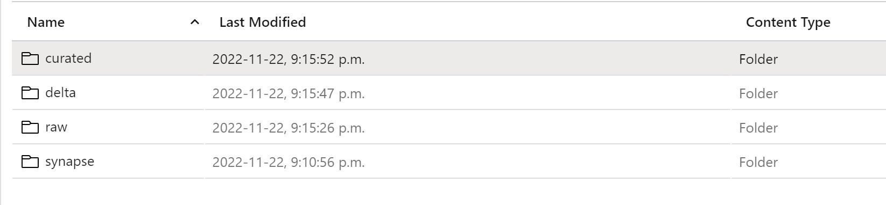
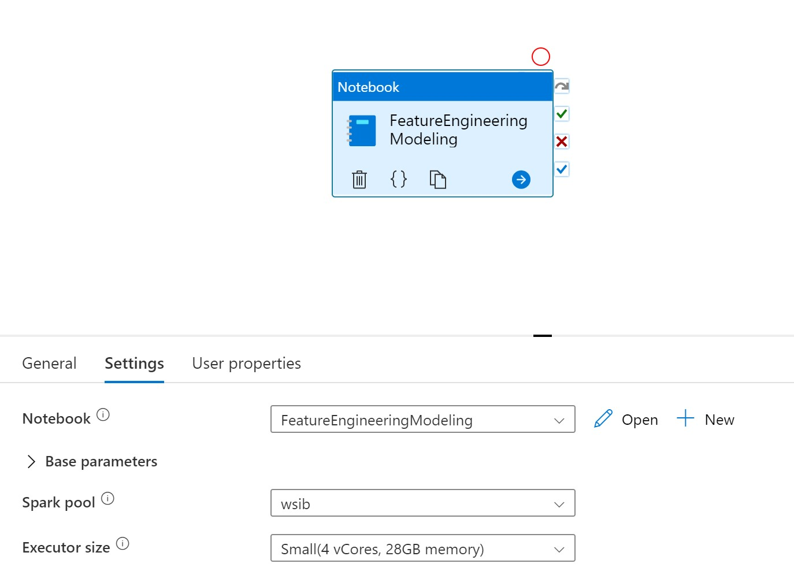

# synapse-spark-aml-workshop

#### Step 1: Data lake structure
Set-up common data lake structure as per image:


#### Step 2: Spark pool in Synapse
Create a spark pool in Synapse Analytics and make sure to upload the ```requirements.txt``` file to install additional libraries

